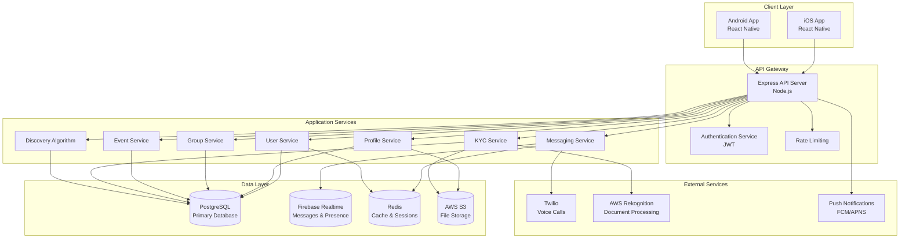
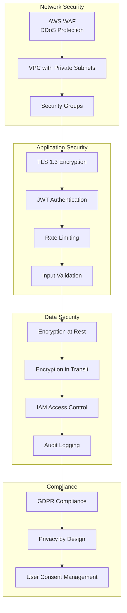
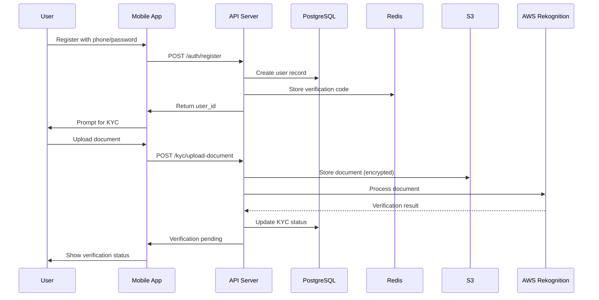
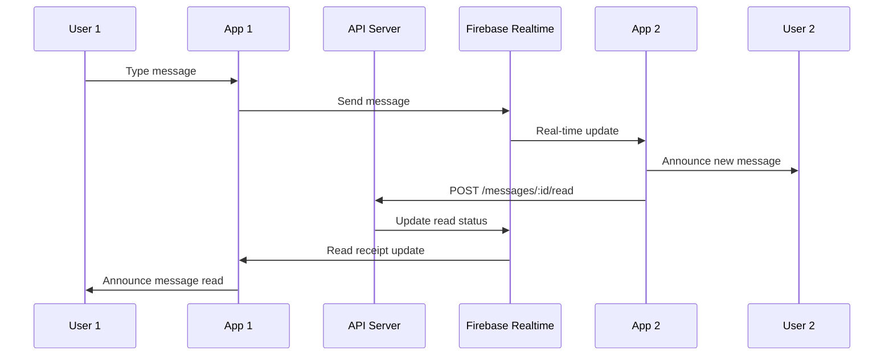
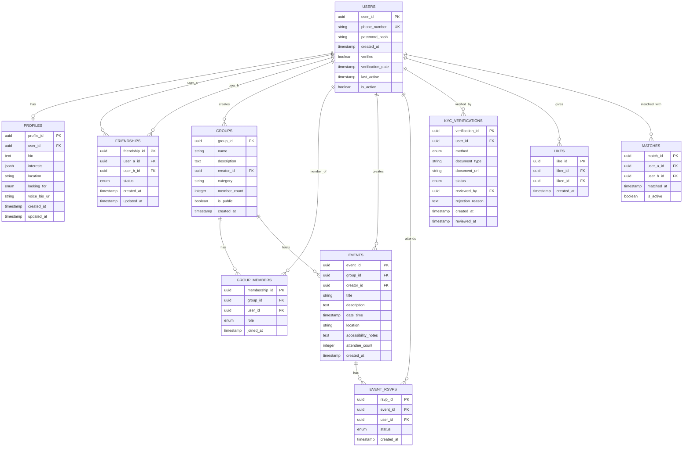
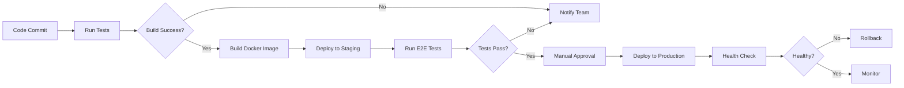
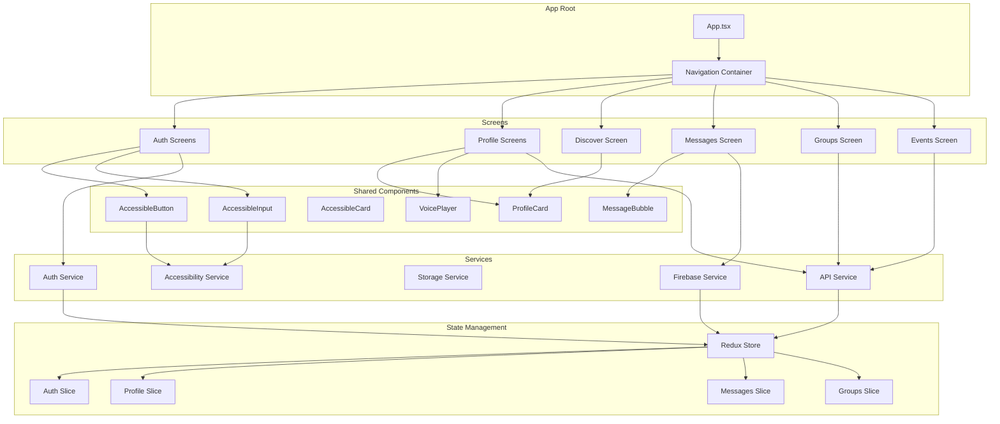
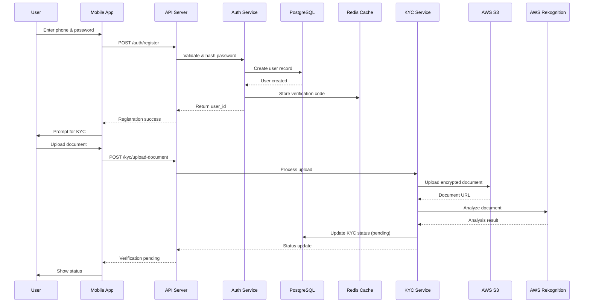
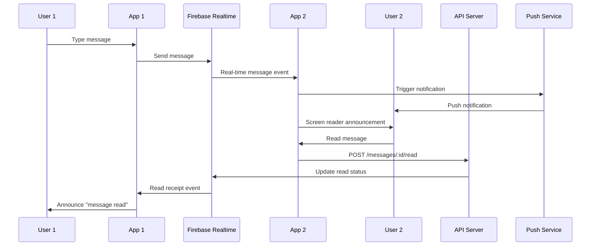

# VOX - Product Requirements Document

**Version:** 2.0  
**Date:** January 2025  
**Status:** Confidential  
**Last Updated:** January 2025

---

## Table of Contents

1. [Executive Summary](#executive-summary)
2. [Problem Statement](#1-problem-statement)
3. [Solution Overview](#2-solution-overview)
4. [Target Users](#3-target-users)
5. [Core Features](#4-core-features)
6. [System Architecture Design](#5-system-architecture-design)
7. [Database Schema](#6-database-schema)
8. [API Endpoints](#7-api-endpoints)
9. [Performance Requirements](#8-performance-requirements)
10. [Monitoring and Observability](#9-monitoring-and-observability)
11. [Testing Strategy](#10-testing-strategy)
12. [Deployment Strategy](#11-deployment-strategy)
13. [Component Architecture](#12-component-architecture)
14. [Accessibility Requirements](#13-accessibility-requirements)
15. [Development Timeline](#14-development-timeline)
16. [Revenue Model](#15-revenue-model)
17. [Market Opportunity](#16-market-opportunity)
18. [Success Factors](#17-success-factors)
19. [Phase Two: Future Enhancements](#18-phase-two-future-enhancements)
20. [Critical Developer Notes](#19-critical-developer-notes)
21. [Security Considerations](#20-security-considerations)
22. [Success Metrics](#21-success-metrics)
23. [Risk Mitigation](#22-risk-mitigation)
24. [Launch Criteria](#23-launch-criteria)
25. [Post-Launch Roadmap](#24-post-launch-roadmap)
26. [Appendix](#25-appendix)

---

## Executive Summary

### Project Overview
VOX is a community platform exclusively designed for blind and visually impaired people. Built from day one by a visually impaired entrepreneur, VOX addresses the profound isolation faced by blind communities by creating a dedicated space for connection, friendship, dating, and community building.

### Mission Statement
Connect blind and visually impaired people through community, not technology. VOX is not another accessibility feature bolted onto an existing platform—it is built from day one by a blind person for blind people.

### Key Metrics
- **Location:** Malta (with European expansion roadmap)
- **Timeline:** Five-week prototype development
- **Platform:** iOS and Android (React Native)
- **User Base:** Verified blind and visually impaired individuals only
- **Revenue Model:** Ad-supported (free forever for users)

---

## 1. Problem Statement

### The Core Problem
Blind and visually impaired people face profound isolation. Existing platforms like Instagram and WhatsApp were designed for sighted users and lack built-in tools for peer discovery. Dating apps do not work. Generic accessibility solutions feel clinical, not like home.

### Key Pain Points
- **Loneliness:** Being visually impaired in Malta (and globally) is difficult not because of accessibility tools, but because of loneliness
- **No Dedicated Space:** There is no space designed specifically for blind people to meet each other, build genuine friendships, share experiences, and find romantic connections
- **Inadequate Accessibility:** Existing platforms treat accessibility as an afterthought, not as a foundational requirement
- **Failed Discovery:** Dating apps and social platforms fail to facilitate meaningful connections within the blind community

### Why This Matters
Accessibility is not a feature here—it is the entire foundation. The real gap is the absence of a space where blind people can authentically connect with each other.

---

## 2. Solution Overview

### Product Vision
VOX is a community platform exclusively for blind and visually impaired people, built from day one with their needs in mind. The platform prioritizes community first, validating that people want this space, then adding enhancements when the foundation is strong.

### Development Philosophy
- **Community First:** Build core community features, validate trust, then add technology enhancements
- **Accessibility by Design:** Every feature must be accessible to screen reader users from day one
- **Verified Community:** KYC ensures only real blind and visually impaired users, creating a safe, genuine space
- **No Subscription Burden:** Free forever for users, funded through targeted advertising

### Phase Strategy
- **Phase One:** Community messaging, voice calls, interest-based groups, friendship discovery, local event coordination
- **Phase Two:** AI scene description and advanced profile matching (after community trust is established)

---

## 3. Target Users

### Primary User Persona
- **Demographics:** Blind and visually impaired individuals in Malta (expanding to Europe)
- **Age Range:** 18+ years
- **Tech Comfort:** Users of screen readers (VoiceOver, TalkBack) and assistive technology
- **Goals:** 
  - Make friends within the blind community
  - Find romantic connections
  - Participate in community events
  - Share experiences and support
  - Build genuine relationships

### User Verification
VOX is exclusively for blind and visually impaired individuals. Verification uses three methods:
1. **Self-attestation plus document verification**
2. **Video call verification** with trained moderators
3. **Trusted referral** from existing verified members

**Why Verification Matters:**
- Prevents bad actors
- Maintains community trust
- Creates a space where every member belongs

---

## 4. Core Features

### 4.1 Accessible User Profiles
**Description:** Screen reader optimized profiles that capture user identity without requiring photos.

**Requirements:**
- Screen reader optimized interface
- Bio text field
- Interests selection (multiple tags)
- Location preference
- Connection goals (dating, friendship, hobby)
- Voice bio option (audio recording)
- No photo requirement

**Acceptance Criteria:**
- All profile fields readable by VoiceOver/TalkBack
- Voice bio playback accessible via screen reader
- Profile creation completable without visual elements

---

### 4.2 Direct Messaging and Voice Calls
**Description:** Real-time text and voice communication with full accessibility support.

**Requirements:**
- Real-time text messaging
- Voice calls with audio-only interface
- Reliable message delivery
- Voice transcription (optional, Phase Two)
- Typing indicators (announced via screen reader)
- Read receipts
- Message encryption (TLS in transit)
- Offline message queue with sync

**Acceptance Criteria:**
- Messages readable by screen reader in chronological order
- Voice calls accessible without visual UI
- Typing indicators announced appropriately
- Offline messages sync when connection restored

---

### 4.3 Interest-Based Groups
**Description:** Community groups organized by topic, enabling like-minded connections.

**Group Categories:**
- Dating
- Sports
- Hobbies
- Career support
- Mental health
- Other community interests

**Requirements:**
- Group creation and management
- Member management
- Group voice calls
- Event creation within groups
- Moderation by trusted members
- Admin controls
- Group messaging (multiple recipients)

**Acceptance Criteria:**
- Group listings navigable via screen reader
- Group creation workflow fully accessible
- Group messaging readable and navigable
- Moderation controls accessible

---

### 4.4 Friendship Discovery
**Description:** Algorithm-driven profile suggestions to help users find meaningful connections.

**Requirements:**
- Algorithm-based suggestions (interests, location, goals)
- Anonymous profile browsing
- Like system for matches
- Mutual match notifications
- Safety controls on all messaging
- Privacy controls (anonymous until mutual like)

**Algorithm Factors:**
- Common interests
- Geographic proximity
- Connection goals alignment
- Activity level

**Acceptance Criteria:**
- Discovery feed navigable via screen reader
- Profile cards announce all relevant information
- Like/match actions accessible
- Privacy respected until mutual interest

---

### 4.5 Local Events Calendar
**Description:** User-created meetups and community events with accessible coordination.

**Requirements:**
- Event creation by users/groups
- RSVP tracking
- Accessible venue information (text descriptions)
- Integrated group chat for attendees
- Event reminders via push notification
- Calendar integration (accessible calendar apps)

**Event Information Required:**
- Title and description
- Date and time
- Location (accessible description)
- Accessibility notes
- Organizer contact

**Acceptance Criteria:**
- Event listings fully readable by screen reader
- RSVP workflow accessible
- Event details include accessibility information
- Reminders delivered via accessible notifications

---

## 5. System Architecture Design

### 5.1 High-Level Architecture Overview



### 5.2 Frontend Architecture

**Technology Stack:**
- **Framework:** React Native with Expo
- **Language:** TypeScript
- **State Management:** Redux Toolkit or Zustand
- **Navigation:** React Navigation
- **Screen Reader Support:** AccessibilityInfo API, React Native Accessibility
- **Offline Support:** AsyncStorage + Redux Persist
- **Real-time Updates:** Firebase SDK listeners
- **HTTP Client:** Axios with interceptors
- **Form Handling:** React Hook Form
- **Voice:** React Native Voice (for voice bios)

**Component Architecture:**
```
src/
├── components/
│   ├── accessible/          # Accessibility wrapper components
│   ├── profile/            # Profile-related components
│   ├── messaging/          # Messaging components
│   ├── groups/             # Group components
│   ├── events/             # Event components
│   └── common/             # Shared components
├── screens/
│   ├── auth/               # Authentication screens
│   ├── profile/            # Profile screens
│   ├── discover/           # Discovery screens
│   ├── messages/           # Messaging screens
│   ├── groups/             # Group screens
│   └── events/             # Event screens
├── services/
│   ├── api/                # API service layer
│   ├── firebase/           # Firebase integration
│   ├── storage/            # Local storage
│   └── accessibility/      # Accessibility helpers
├── store/                  # Redux store
├── hooks/                  # Custom React hooks
└── utils/                  # Utility functions
```

**Key Requirements:**
- Cross-platform iOS and Android
- Screen reader optimization for all components
- Offline-first messaging architecture
- Real-time updates via Firebase
- Optimistic UI updates
- Error boundary implementation
- Deep linking support

---

### 5.3 Backend Architecture

**Technology Stack:**
- **Runtime:** Node.js 18+
- **Framework:** Express.js
- **Language:** TypeScript
- **Authentication:** JWT (jsonwebtoken)
- **Validation:** Joi or Zod
- **ORM:** Prisma or TypeORM
- **Real-time:** Firebase Admin SDK
- **File Upload:** Multer + AWS SDK
- **Queue:** Bull (Redis-based)
- **Monitoring:** Winston (logging), Sentry (error tracking)
- **Testing:** Jest, Supertest

**Service Architecture:**
```
src/
├── controllers/           # Request handlers
├── services/              # Business logic
├── models/                # Data models
├── middleware/            # Express middleware
│   ├── auth.middleware.ts
│   ├── validation.middleware.ts
│   ├── rateLimit.middleware.ts
│   └── error.middleware.ts
├── routes/                # API routes
├── utils/                 # Utility functions
├── config/                # Configuration
└── types/                 # TypeScript types
```

**Key Requirements:**
- RESTful API endpoints
- Secure authentication system
- Real-time messaging infrastructure
- Automated KYC workflow
- Comprehensive error handling
- Request validation
- API versioning
- Health check endpoints

---

### 5.4 Data Architecture

**Database Systems:**
- **Primary Database:** PostgreSQL 14+ (AWS RDS)
- **Real-time Database:** Firebase Realtime Database
- **File Storage:** AWS S3 (with CloudFront CDN)
- **Caching:** Redis 7+ (ElastiCache)
- **Search:** PostgreSQL Full-Text Search (Phase 1), Elasticsearch (Phase 2)

**Data Distribution:**

**PostgreSQL Stores:**
- User accounts and authentication
- User profiles and preferences
- Groups and memberships
- Events and RSVPs
- Friendships and matches
- KYC verification records
- System logs and audit trails

**Firebase Realtime Stores:**
- Real-time messages (encrypted)
- User presence status
- Typing indicators
- Call status
- Live event updates

**Redis Caches:**
- User sessions
- JWT tokens (blacklist)
- Frequently accessed profiles
- Discovery algorithm results
- Rate limiting counters
- Temporary verification codes

**S3 Stores:**
- Profile pictures (optional)
- Voice bios
- KYC documents (encrypted)
- Event images (if any)

---

### 5.5 Infrastructure Architecture

**Cloud Services:**
- **Hosting:** AWS Elastic Beanstalk (auto-scaling)
- **Database:** AWS RDS PostgreSQL (Multi-AZ)
- **File Storage:** AWS S3 + CloudFront CDN
- **Caching:** AWS ElastiCache (Redis)
- **Document Processing:** AWS Rekognition
- **Voice Calls:** Twilio (WebRTC)
- **Push Notifications:** Firebase Cloud Messaging (FCM) / Apple Push Notification Service (APNS)
- **Monitoring:** CloudWatch, Sentry
- **CI/CD:** GitHub Actions / AWS CodePipeline

**Deployment Architecture:**

```mermaid
graph TB
    subgraph "Development"
        Dev[Dev Environment]
    end
    
    subgraph "Staging"
        Staging[Staging Environment]
    end
    
    subgraph "Production"
        LB[Application Load Balancer]
        subgraph "Auto Scaling Group"
            App1[App Instance 1]
            App2[App Instance 2]
            App3[App Instance N]
        end
    end
    
    subgraph "Data Layer"
        RDS[(RDS PostgreSQL<br/>Multi-AZ)]
        ElastiCache[(ElastiCache Redis)]
        S3[(S3 + CloudFront)]
    end
    
    subgraph "External Services"
        Firebase[Firebase Realtime]
        Twilio[Twilio]
        Rekognition[AWS Rekognition]
    end
    
    Dev --> Staging
    Staging --> Production
    LB --> App1
    LB --> App2
    LB --> App3
    
    App1 --> RDS
    App2 --> RDS
    App3 --> RDS
    
    App1 --> ElastiCache
    App2 --> ElastiCache
    App3 --> ElastiCache
    
    App1 --> S3
    App2 --> S3
    App3 --> S3
    
    App1 --> Firebase
    App2 --> Firebase
    App3 --> Firebase
    
    App1 --> Twilio
    App2 --> Twilio
    App3 --> Twilio
    
    App1 --> Rekognition
    App2 --> Rekognition
    App3 --> Rekognition
```

---

### 5.6 Security Architecture

**Security Layers:**



**Security Measures:**
- **Network:** VPC isolation, security groups, WAF for DDoS protection
- **Application:** JWT tokens, bcrypt password hashing, rate limiting, input sanitization
- **Data:** AES-256 encryption at rest, TLS 1.3 in transit, encrypted S3 buckets
- **Access:** IAM roles, least privilege principle, MFA for admin access
- **Compliance:** GDPR compliance, data retention policies, user consent management

---

### 5.7 Data Flow Architecture

**User Registration Flow:**



**Messaging Flow:**



---

### 5.8 API Architecture

**API Design Principles:**
- RESTful conventions
- Versioned endpoints (`/api/v1/...`)
- Consistent error responses
- Pagination for list endpoints
- Filtering and sorting support
- Request/response logging

**API Response Format:**
```typescript
// Success Response
{
  "success": true,
  "data": { ... },
  "meta": {
    "timestamp": "2025-01-19T12:00:00Z",
    "requestId": "uuid"
  }
}

// Error Response
{
  "success": false,
  "error": {
    "code": "ERROR_CODE",
    "message": "Human-readable message",
    "details": { ... }
  },
  "meta": {
    "timestamp": "2025-01-19T12:00:00Z",
    "requestId": "uuid"
  }
}
```

**Rate Limiting:**
- Authentication endpoints: 5 requests/minute
- General endpoints: 100 requests/minute
- Messaging endpoints: 200 requests/minute
- File upload endpoints: 10 requests/minute

---

## 6. Database Schema

### 6.1 Entity Relationship Diagram



### 6.2 Detailed Schema Definitions

#### Users Table
```sql
CREATE TABLE users (
    user_id UUID PRIMARY KEY DEFAULT gen_random_uuid(),
    phone_number VARCHAR(20) UNIQUE NOT NULL,
    password_hash VARCHAR(255) NOT NULL,
    created_at TIMESTAMP DEFAULT CURRENT_TIMESTAMP,
    verified BOOLEAN DEFAULT FALSE,
    verification_date TIMESTAMP,
    last_active TIMESTAMP,
    is_active BOOLEAN DEFAULT TRUE,
    email VARCHAR(255), -- Optional for password recovery
    INDEX idx_phone (phone_number),
    INDEX idx_verified (verified),
    INDEX idx_active (is_active)
);
```

#### Profiles Table
```sql
CREATE TABLE profiles (
    profile_id UUID PRIMARY KEY DEFAULT gen_random_uuid(),
    user_id UUID UNIQUE NOT NULL REFERENCES users(user_id) ON DELETE CASCADE,
    bio TEXT,
    interests JSONB DEFAULT '[]'::jsonb, -- Array of interest tags
    location VARCHAR(255),
    looking_for VARCHAR(20) CHECK (looking_for IN ('dating', 'friendship', 'hobby', 'all')),
    voice_bio_url VARCHAR(500),
    created_at TIMESTAMP DEFAULT CURRENT_TIMESTAMP,
    updated_at TIMESTAMP DEFAULT CURRENT_TIMESTAMP,
    INDEX idx_location (location),
    INDEX idx_looking_for (looking_for),
    INDEX idx_interests USING GIN (interests) -- GIN index for JSONB array queries
);
```

#### Groups Table
```sql
CREATE TABLE groups (
    group_id UUID PRIMARY KEY DEFAULT gen_random_uuid(),
    name VARCHAR(255) NOT NULL,
    description TEXT,
    creator_id UUID NOT NULL REFERENCES users(user_id),
    category VARCHAR(50) NOT NULL,
    member_count INTEGER DEFAULT 0,
    is_public BOOLEAN DEFAULT TRUE,
    created_at TIMESTAMP DEFAULT CURRENT_TIMESTAMP,
    INDEX idx_category (category),
    INDEX idx_creator (creator_id),
    INDEX idx_public (is_public)
);
```

#### Group Members Table
```sql
CREATE TABLE group_members (
    membership_id UUID PRIMARY KEY DEFAULT gen_random_uuid(),
    group_id UUID NOT NULL REFERENCES groups(group_id) ON DELETE CASCADE,
    user_id UUID NOT NULL REFERENCES users(user_id) ON DELETE CASCADE,
    role VARCHAR(20) DEFAULT 'member' CHECK (role IN ('member', 'moderator', 'admin')),
    joined_at TIMESTAMP DEFAULT CURRENT_TIMESTAMP,
    UNIQUE(group_id, user_id),
    INDEX idx_group (group_id),
    INDEX idx_user (user_id)
);
```

#### Friendships Table
```sql
CREATE TABLE friendships (
    friendship_id UUID PRIMARY KEY DEFAULT gen_random_uuid(),
    user_a_id UUID NOT NULL REFERENCES users(user_id) ON DELETE CASCADE,
    user_b_id UUID NOT NULL REFERENCES users(user_id) ON DELETE CASCADE,
    status VARCHAR(20) DEFAULT 'pending' CHECK (status IN ('pending', 'accepted', 'blocked')),
    created_at TIMESTAMP DEFAULT CURRENT_TIMESTAMP,
    updated_at TIMESTAMP DEFAULT CURRENT_TIMESTAMP,
    CHECK (user_a_id < user_b_id), -- Ensure consistent ordering
    UNIQUE(user_a_id, user_b_id),
    INDEX idx_user_a (user_a_id),
    INDEX idx_user_b (user_b_id),
    INDEX idx_status (status)
);
```

#### Events Table
```sql
CREATE TABLE events (
    event_id UUID PRIMARY KEY DEFAULT gen_random_uuid(),
    group_id UUID REFERENCES groups(group_id) ON DELETE SET NULL,
    creator_id UUID NOT NULL REFERENCES users(user_id),
    title VARCHAR(255) NOT NULL,
    description TEXT,
    date_time TIMESTAMP NOT NULL,
    location VARCHAR(500) NOT NULL,
    accessibility_notes TEXT,
    attendee_count INTEGER DEFAULT 0,
    created_at TIMESTAMP DEFAULT CURRENT_TIMESTAMP,
    INDEX idx_group (group_id),
    INDEX idx_creator (creator_id),
    INDEX idx_date_time (date_time)
);
```

#### Event RSVPs Table
```sql
CREATE TABLE event_rsvps (
    rsvp_id UUID PRIMARY KEY DEFAULT gen_random_uuid(),
    event_id UUID NOT NULL REFERENCES events(event_id) ON DELETE CASCADE,
    user_id UUID NOT NULL REFERENCES users(user_id) ON DELETE CASCADE,
    status VARCHAR(20) DEFAULT 'going' CHECK (status IN ('going', 'maybe', 'not_going')),
    created_at TIMESTAMP DEFAULT CURRENT_TIMESTAMP,
    UNIQUE(event_id, user_id),
    INDEX idx_event (event_id),
    INDEX idx_user (user_id)
);
```

#### KYC Verifications Table
```sql
CREATE TABLE kyc_verifications (
    verification_id UUID PRIMARY KEY DEFAULT gen_random_uuid(),
    user_id UUID NOT NULL REFERENCES users(user_id) ON DELETE CASCADE,
    method VARCHAR(20) NOT NULL CHECK (method IN ('document', 'video_call', 'referral')),
    document_type VARCHAR(50), -- 'passport', 'id_card', etc.
    document_url VARCHAR(500), -- S3 URL (encrypted)
    status VARCHAR(20) DEFAULT 'pending' CHECK (status IN ('pending', 'approved', 'rejected')),
    reviewed_by UUID REFERENCES users(user_id), -- Moderator who reviewed
    rejection_reason TEXT,
    created_at TIMESTAMP DEFAULT CURRENT_TIMESTAMP,
    reviewed_at TIMESTAMP,
    INDEX idx_user (user_id),
    INDEX idx_status (status),
    INDEX idx_method (method)
);
```

#### Likes Table
```sql
CREATE TABLE likes (
    like_id UUID PRIMARY KEY DEFAULT gen_random_uuid(),
    liker_id UUID NOT NULL REFERENCES users(user_id) ON DELETE CASCADE,
    liked_id UUID NOT NULL REFERENCES users(user_id) ON DELETE CASCADE,
    created_at TIMESTAMP DEFAULT CURRENT_TIMESTAMP,
    CHECK (liker_id != liked_id),
    UNIQUE(liker_id, liked_id),
    INDEX idx_liker (liker_id),
    INDEX idx_liked (liked_id)
);
```

#### Matches Table
```sql
CREATE TABLE matches (
    match_id UUID PRIMARY KEY DEFAULT gen_random_uuid(),
    user_a_id UUID NOT NULL REFERENCES users(user_id) ON DELETE CASCADE,
    user_b_id UUID NOT NULL REFERENCES users(user_id) ON DELETE CASCADE,
    matched_at TIMESTAMP DEFAULT CURRENT_TIMESTAMP,
    is_active BOOLEAN DEFAULT TRUE,
    CHECK (user_a_id < user_b_id), -- Ensure consistent ordering
    UNIQUE(user_a_id, user_b_id),
    INDEX idx_user_a (user_a_id),
    INDEX idx_user_b (user_b_id),
    INDEX idx_active (is_active)
);
```

### 6.3 Firebase Realtime Database Structure

```json
{
  "messages": {
    "{conversationId}": {
      "{messageId}": {
        "senderId": "uuid",
        "content": "string",
        "createdAt": "timestamp",
        "readAt": "timestamp",
        "type": "text|voice|system"
      }
    }
  },
  "presence": {
    "{userId}": {
      "status": "online|offline|away",
      "lastSeen": "timestamp"
    }
  },
  "typing": {
    "{conversationId}": {
      "{userId}": {
        "isTyping": "boolean",
        "timestamp": "timestamp"
      }
    }
  },
  "calls": {
    "{callId}": {
      "callerId": "uuid",
      "receiverId": "uuid",
      "status": "ringing|answered|ended",
      "startedAt": "timestamp",
      "endedAt": "timestamp"
    }
  }
}
```

### 6.4 Database Indexes and Performance

**Critical Indexes:**
- User lookup by phone number
- Profile discovery by location and interests
- Friendship status queries
- Event queries by date and location
- Group membership lookups
- KYC status tracking

**Query Optimization:**
- Use connection pooling (pgBouncer)
- Implement read replicas for heavy read operations
- Cache frequently accessed data in Redis
- Use materialized views for complex discovery queries
- Partition large tables by date if needed

---

## 7. API Endpoints

### 7.1 API Base URL
- **Production:** `https://api.vox.app/v1`
- **Staging:** `https://staging-api.vox.app/v1`
- **Development:** `http://localhost:3000/v1`

### 7.2 Authentication Endpoints

#### POST /auth/register
Register a new user account.

**Request:**
```json
{
  "phoneNumber": "+35612345678",
  "password": "SecurePassword123!",
  "countryCode": "MT"
}
```

**Response (201):**
```json
{
  "success": true,
  "data": {
    "userId": "uuid",
    "phoneNumber": "+35612345678",
    "requiresVerification": true
  }
}
```

#### POST /auth/login
Authenticate user and receive JWT token.

**Request:**
```json
{
  "phoneNumber": "+35612345678",
  "password": "SecurePassword123!"
}
```

**Response (200):**
```json
{
  "success": true,
  "data": {
    "token": "jwt_token",
    "refreshToken": "refresh_token",
    "expiresIn": 3600,
    "user": {
      "userId": "uuid",
      "verified": true
    }
  }
}
```

#### POST /auth/refresh
Refresh JWT token using refresh token.

**Headers:** `Authorization: Bearer {refreshToken}`

**Response (200):**
```json
{
  "success": true,
  "data": {
    "token": "new_jwt_token",
    "expiresIn": 3600
  }
}
```

#### POST /auth/logout
Invalidate current session.

**Headers:** `Authorization: Bearer {token}`

**Response (200):**
```json
{
  "success": true,
  "message": "Logged out successfully"
}
```

---

### 7.3 Profile Endpoints

#### GET /profile/:userId
Retrieve user profile.

**Headers:** `Authorization: Bearer {token}`

**Response (200):**
```json
{
  "success": true,
  "data": {
    "profileId": "uuid",
    "userId": "uuid",
    "bio": "User bio text",
    "interests": ["sports", "music", "travel"],
    "location": "Valletta, Malta",
    "lookingFor": "friendship",
    "hasVoiceBio": true,
    "createdAt": "2025-01-19T12:00:00Z"
  }
}
```

#### PUT /profile/:userId
Update user profile.

**Headers:** `Authorization: Bearer {token}`

**Request:**
```json
{
  "bio": "Updated bio",
  "interests": ["sports", "music"],
  "location": "Sliema, Malta",
  "lookingFor": "dating"
}
```

#### GET /profiles/discover
Get profile suggestions based on discovery algorithm.

**Headers:** `Authorization: Bearer {token}`

**Query Parameters:**
- `limit` (default: 20, max: 50)
- `offset` (default: 0)
- `location` (optional filter)
- `lookingFor` (optional filter)

**Response (200):**
```json
{
  "success": true,
  "data": {
    "profiles": [
      {
        "profileId": "uuid",
        "bio": "Bio text",
        "interests": ["sports"],
        "location": "Valletta",
        "lookingFor": "friendship",
        "matchScore": 0.85
      }
    ],
    "pagination": {
      "limit": 20,
      "offset": 0,
      "total": 150,
      "hasMore": true
    }
  }
}
```

#### POST /profile/:userId/like
Like a profile.

**Headers:** `Authorization: Bearer {token}`

**Response (200):**
```json
{
  "success": true,
  "data": {
    "likeId": "uuid",
    "isMatch": false,
    "message": "Like recorded"
  }
}
```

**Response if Match (200):**
```json
{
  "success": true,
  "data": {
    "likeId": "uuid",
    "isMatch": true,
    "matchId": "uuid",
    "message": "It's a match!"
  }
}
```

#### GET /matches
Get all mutual matches.

**Headers:** `Authorization: Bearer {token}`

**Response (200):**
```json
{
  "success": true,
  "data": {
    "matches": [
      {
        "matchId": "uuid",
        "profile": {
          "profileId": "uuid",
          "bio": "Bio",
          "interests": ["sports"]
        },
        "matchedAt": "2025-01-19T12:00:00Z"
      }
    ]
  }
}
```

---

### 7.4 Messaging Endpoints

#### POST /messages
Send a message to another user.

**Headers:** `Authorization: Bearer {token}`

**Request:**
```json
{
  "recipientId": "uuid",
  "content": "Hello!",
  "type": "text"
}
```

**Response (201):**
```json
{
  "success": true,
  "data": {
    "messageId": "uuid",
    "conversationId": "uuid",
    "sentAt": "2025-01-19T12:00:00Z"
  }
}
```

**Note:** Actual message storage is in Firebase Realtime Database. This endpoint creates the conversation record.

#### GET /messages/:conversationId
Get conversation history (metadata only, actual messages from Firebase).

**Headers:** `Authorization: Bearer {token}`

**Query Parameters:**
- `limit` (default: 50, max: 100)
- `before` (timestamp for pagination)

**Response (200):**
```json
{
  "success": true,
  "data": {
    "conversationId": "uuid",
    "participants": ["uuid1", "uuid2"],
    "lastMessageAt": "2025-01-19T12:00:00Z",
    "unreadCount": 3
  }
}
```

#### GET /conversations
Get all user conversations.

**Headers:** `Authorization: Bearer {token}`

**Response (200):**
```json
{
  "success": true,
  "data": {
    "conversations": [
      {
        "conversationId": "uuid",
        "otherUser": {
          "userId": "uuid",
          "profile": { ... }
        },
        "lastMessage": "Last message preview",
        "lastMessageAt": "2025-01-19T12:00:00Z",
        "unreadCount": 2
      }
    ]
  }
}
```

#### POST /messages/:messageId/read
Mark message as read.

**Headers:** `Authorization: Bearer {token}`

**Response (200):**
```json
{
  "success": true,
  "data": {
    "messageId": "uuid",
    "readAt": "2025-01-19T12:00:00Z"
  }
}
```

#### POST /call/initiate
Initiate a voice call.

**Headers:** `Authorization: Bearer {token}`

**Request:**
```json
{
  "recipientId": "uuid"
}
```

**Response (200):**
```json
{
  "success": true,
  "data": {
    "callId": "uuid",
    "twilioToken": "token_for_webrtc",
    "roomName": "room_name"
  }
}
```

#### GET /call/history
Get call history.

**Headers:** `Authorization: Bearer {token}`

**Response (200):**
```json
{
  "success": true,
  "data": {
    "calls": [
      {
        "callId": "uuid",
        "participantId": "uuid",
        "duration": 300,
        "status": "completed",
        "startedAt": "2025-01-19T12:00:00Z"
      }
    ]
  }
}
```

---

### 7.5 Group Endpoints

#### POST /groups
Create a new group.

**Headers:** `Authorization: Bearer {token}`

**Request:**
```json
{
  "name": "Malta Blind Sports Club",
  "description": "Group for blind sports enthusiasts",
  "category": "sports",
  "isPublic": true
}
```

**Response (201):**
```json
{
  "success": true,
  "data": {
    "groupId": "uuid",
    "name": "Malta Blind Sports Club",
    "memberCount": 1,
    "createdAt": "2025-01-19T12:00:00Z"
  }
}
```

#### GET /groups
List groups with filtering.

**Headers:** `Authorization: Bearer {token}`

**Query Parameters:**
- `category` (optional)
- `search` (optional, search by name)
- `limit` (default: 20)
- `offset` (default: 0)

#### GET /groups/:groupId
Get group details.

**Headers:** `Authorization: Bearer {token}`

**Response (200):**
```json
{
  "success": true,
  "data": {
    "groupId": "uuid",
    "name": "Group Name",
    "description": "Description",
    "category": "sports",
    "memberCount": 25,
    "isMember": true,
    "role": "member",
    "createdAt": "2025-01-19T12:00:00Z"
  }
}
```

#### POST /groups/:groupId/join
Join a group.

**Headers:** `Authorization: Bearer {token}`

**Response (200):**
```json
{
  "success": true,
  "data": {
    "membershipId": "uuid",
    "joinedAt": "2025-01-19T12:00:00Z"
  }
}
```

---

### 7.6 Event Endpoints

#### POST /events
Create an event.

**Headers:** `Authorization: Bearer {token}`

**Request:**
```json
{
  "groupId": "uuid", // Optional
  "title": "Community Meetup",
  "description": "Monthly community gathering",
  "dateTime": "2025-02-15T18:00:00Z",
  "location": "Valletta Community Center",
  "accessibilityNotes": "Wheelchair accessible, guide dogs welcome"
}
```

**Response (201):**
```json
{
  "success": true,
  "data": {
    "eventId": "uuid",
    "title": "Community Meetup",
    "attendeeCount": 1,
    "createdAt": "2025-01-19T12:00:00Z"
  }
}
```

#### GET /events
List events with filtering.

**Headers:** `Authorization: Bearer {token}`

**Query Parameters:**
- `groupId` (optional, filter by group)
- `location` (optional)
- `startDate` (optional, ISO date)
- `endDate` (optional, ISO date)
- `limit` (default: 20)
- `offset` (default: 0)

#### POST /events/:eventId/rsvp
RSVP to an event.

**Headers:** `Authorization: Bearer {token}`

**Request:**
```json
{
  "status": "going" // "going", "maybe", "not_going"
}
```

**Response (200):**
```json
{
  "success": true,
  "data": {
    "rsvpId": "uuid",
    "status": "going",
    "createdAt": "2025-01-19T12:00:00Z"
  }
}
```

---

### 7.7 KYC Verification Endpoints

#### POST /kyc/initiate
Start KYC verification process.

**Headers:** `Authorization: Bearer {token}`

**Request:**
```json
{
  "method": "document" // "document", "video_call", "referral"
}
```

**Response (200):**
```json
{
  "success": true,
  "data": {
    "verificationId": "uuid",
    "method": "document",
    "status": "pending",
    "uploadUrl": "https://s3.../upload-url"
  }
}
```

#### POST /kyc/upload-document
Upload verification document.

**Headers:** `Authorization: Bearer {token}`

**Request:** Multipart form data
- `document` (file)
- `documentType` (string: "passport", "id_card", etc.)

**Response (200):**
```json
{
  "success": true,
  "data": {
    "verificationId": "uuid",
    "status": "pending",
    "message": "Document uploaded, awaiting review"
  }
}
```

#### POST /kyc/schedule-call
Schedule video verification call.

**Headers:** `Authorization: Bearer {token}`

**Request:**
```json
{
  "preferredDate": "2025-01-25",
  "preferredTime": "14:00",
  "timezone": "Europe/Malta"
}
```

**Response (200):**
```json
{
  "success": true,
  "data": {
    "verificationId": "uuid",
    "scheduledAt": "2025-01-25T14:00:00Z",
    "meetingLink": "https://zoom.us/..."
  }
}
```

#### GET /kyc/status
Check verification status.

**Headers:** `Authorization: Bearer {token}`

**Response (200):**
```json
{
  "success": true,
  "data": {
    "verificationId": "uuid",
    "status": "approved",
    "method": "document",
    "reviewedAt": "2025-01-19T12:00:00Z"
  }
}
```

---

### 7.8 Error Responses

All endpoints may return the following error codes:

**400 Bad Request:**
```json
{
  "success": false,
  "error": {
    "code": "VALIDATION_ERROR",
    "message": "Invalid input data",
    "details": {
      "field": "phoneNumber",
      "reason": "Invalid phone number format"
    }
  }
}
```

**401 Unauthorized:**
```json
{
  "success": false,
  "error": {
    "code": "UNAUTHORIZED",
    "message": "Invalid or expired token"
  }
}
```

**403 Forbidden:**
```json
{
  "success": false,
  "error": {
    "code": "FORBIDDEN",
    "message": "User not verified"
  }
}
```

**404 Not Found:**
```json
{
  "success": false,
  "error": {
    "code": "NOT_FOUND",
    "message": "Resource not found"
  }
}
```

**429 Too Many Requests:**
```json
{
  "success": false,
  "error": {
    "code": "RATE_LIMIT_EXCEEDED",
    "message": "Too many requests, please try again later",
    "retryAfter": 60
  }
}
```

**500 Internal Server Error:**
```json
{
  "success": false,
  "error": {
    "code": "INTERNAL_ERROR",
    "message": "An unexpected error occurred"
  }
}
```

---

## 8. Performance Requirements

### 8.1 Response Time Targets
- **API Response Time:** < 200ms (p95), < 500ms (p99)
- **Message Delivery:** < 100ms real-time delivery
- **Profile Discovery:** < 300ms for 20 results
- **Voice Call Connection:** < 2 seconds
- **App Launch Time:** < 3 seconds (cold start)
- **Screen Reader Navigation:** < 100ms response to gestures

### 8.2 Throughput Requirements
- **API Requests:** 10,000 requests/minute per instance
- **Concurrent Users:** 5,000 per instance
- **Messages:** 50,000 messages/minute
- **Voice Calls:** 500 concurrent calls

### 8.3 Scalability Targets
- **Horizontal Scaling:** Auto-scale based on CPU (70% threshold) and memory (80% threshold)
- **Database:** Read replicas for query distribution
- **Caching:** 90% cache hit rate for frequently accessed data
- **CDN:** 95% of static assets served from edge locations

### 8.4 Resource Optimization
- **Mobile App Size:** < 50MB (initial download)
- **Data Usage:** < 10MB per hour of active use
- **Battery Impact:** Minimal background processing
- **Memory Usage:** < 200MB RAM on mobile devices
- **Offline Storage:** < 100MB local storage per user

---

## 9. Monitoring and Observability

### 9.1 Application Monitoring

**Metrics to Track:**
- API response times (p50, p95, p99)
- Error rates by endpoint
- Request throughput
- Database query performance
- Cache hit/miss rates
- Active user count
- Message delivery latency
- Voice call quality metrics

**Tools:**
- **APM:** New Relic or Datadog
- **Logging:** Winston + CloudWatch Logs
- **Error Tracking:** Sentry
- **Uptime Monitoring:** Pingdom or UptimeRobot

### 9.2 Infrastructure Monitoring

**Metrics:**
- CPU utilization
- Memory usage
- Disk I/O
- Network throughput
- Database connection pool
- Redis memory usage
- S3 storage and bandwidth

**Tools:**
- AWS CloudWatch
- AWS X-Ray (distributed tracing)
- Custom dashboards (Grafana)

### 9.3 User Experience Monitoring

**Metrics:**
- Screen reader compatibility score
- Accessibility error rate
- App crash rate
- Session duration
- Feature adoption rates
- User satisfaction scores

**Tools:**
- Firebase Analytics
- Custom event tracking
- User feedback collection

### 9.4 Alerting Rules

**Critical Alerts (Immediate Response):**
- API error rate > 5%
- Response time p95 > 1 second
- Database connection failures
- Service downtime
- Security breaches

**Warning Alerts (Monitor Closely):**
- API error rate > 2%
- Response time p95 > 500ms
- High memory usage (> 80%)
- Cache hit rate < 70%
- Unusual traffic patterns

### 9.5 Logging Strategy

**Log Levels:**
- **ERROR:** System errors, exceptions, failures
- **WARN:** Deprecated features, performance issues
- **INFO:** Important business events, user actions
- **DEBUG:** Detailed debugging information (dev/staging only)

**Log Retention:**
- Production: 30 days
- Staging: 14 days
- Development: 7 days

**Sensitive Data:**
- Never log passwords, tokens, or personal information
- Mask phone numbers in logs
- Encrypt audit logs

---

## 10. Testing Strategy

### 10.1 Unit Testing
**Coverage Target:** 80% code coverage

**Focus Areas:**
- Business logic functions
- Utility functions
- Data transformation
- Validation logic
- Algorithm implementations (discovery, matching)

**Tools:**
- Jest (backend)
- React Native Testing Library (frontend)
- Mock Service Worker for API mocking

### 10.2 Integration Testing
**Focus Areas:**
- API endpoint testing
- Database operations
- Firebase integration
- External service integrations (Twilio, AWS)
- Authentication flows

**Tools:**
- Supertest (API testing)
- Test containers for database
- Mock external services

### 10.3 End-to-End Testing
**Critical User Flows:**
1. User registration → KYC → Profile creation
2. Profile discovery → Like → Match → Messaging
3. Group creation → Join → Group messaging
4. Event creation → RSVP → Event attendance
5. Voice call initiation → Connection → Call completion

**Tools:**
- Detox (React Native E2E)
- Appium (alternative)
- Manual testing with real screen readers

### 10.4 Accessibility Testing
**Required Tests:**
- VoiceOver testing on iOS (all features)
- TalkBack testing on Android (all features)
- Screen reader navigation flows
- Touch target size validation
- Color contrast verification
- Focus management testing
- Keyboard navigation (if applicable)

**Testing Process:**
1. Automated accessibility scanning (axe-core)
2. Manual testing with screen readers
3. User testing with blind/visually impaired users
4. Continuous monitoring of accessibility metrics

### 10.5 Performance Testing
**Load Testing:**
- API load testing (k6, Artillery)
- Database query performance
- Concurrent user simulation
- Message throughput testing

**Mobile Performance:**
- App startup time
- Screen transition speed
- Memory leak detection
- Battery usage profiling

### 10.6 Security Testing
**Focus Areas:**
- Authentication and authorization
- Input validation and sanitization
- SQL injection prevention
- XSS prevention
- API security (OWASP Top 10)
- Data encryption verification
- GDPR compliance

**Tools:**
- OWASP ZAP
- Burp Suite
- Custom security audits

### 10.7 Testing Schedule
- **Unit Tests:** Run on every commit (CI)
- **Integration Tests:** Run on every PR
- **E2E Tests:** Run nightly
- **Accessibility Tests:** Run weekly + before releases
- **Performance Tests:** Run monthly
- **Security Tests:** Run quarterly + before releases

---

## 11. Deployment Strategy

### 11.1 Environment Strategy

**Environments:**
1. **Development:** Local development
2. **Staging:** Pre-production testing
3. **Production:** Live environment

**Branch Strategy:**
- `main` → Production
- `develop` → Staging
- `feature/*` → Development

### 11.2 CI/CD Pipeline



**Pipeline Stages:**
1. **Lint & Format:** Code quality checks
2. **Unit Tests:** Fast feedback
3. **Build:** Create Docker images
4. **Integration Tests:** API and database tests
5. **Deploy to Staging:** Automatic
6. **E2E Tests:** Full flow testing
7. **Manual Approval:** Production gate
8. **Deploy to Production:** Blue-green deployment
9. **Health Checks:** Verify deployment
10. **Rollback:** Automatic if health checks fail

### 11.3 Deployment Process

**Blue-Green Deployment:**
- Maintain two identical production environments
- Deploy new version to inactive environment
- Run health checks and smoke tests
- Switch traffic to new environment
- Keep old environment for quick rollback

**Database Migrations:**
- Run migrations before code deployment
- Use backward-compatible migrations
- Test migrations on staging first
- Have rollback scripts ready

### 11.4 Feature Flags
**Use Cases:**
- Gradual feature rollout
- A/B testing
- Emergency feature disable
- Beta feature access

**Tools:**
- LaunchDarkly or custom solution
- Redis for flag storage

### 11.5 Rollback Plan
**Automatic Rollback Triggers:**
- Health check failures
- Error rate spike (> 10%)
- Response time degradation (> 2x baseline)

**Manual Rollback:**
- One-click rollback via deployment dashboard
- Database migration rollback scripts
- Previous Docker image tags maintained

---

## 12. Component Architecture

### 12.1 Frontend Component Structure



### 12.2 Backend Service Architecture

```mermaid
graph TB
    subgraph "API Layer"
        Routes[Express Routes]
        Middleware[Middleware Stack]
    end
    
    subgraph "Controller Layer"
        AuthController[Auth Controller]
        ProfileController[Profile Controller]
        MessageController[Message Controller]
        GroupController[Group Controller]
        EventController[Event Controller]
        KYCController[KYC Controller]
    end
    
    subgraph "Service Layer"
        UserService[User Service]
        ProfileService[Profile Service]
        MessagingService[Messaging Service]
        GroupService[Group Service]
        EventService[Event Service]
        KYCService[KYC Service]
        DiscoveryService[Discovery Service]
        NotificationService[Notification Service]
    end
    
    subgraph "Data Access Layer"
        UserRepo[User Repository]
        ProfileRepo[Profile Repository]
        GroupRepo[Group Repository]
        EventRepo[Event Repository]
        KYCRepo[KYC Repository]
    end
    
    subgraph "External Services"
        FirebaseAdmin[Firebase Admin]
        TwilioSDK[Twilio SDK]
        RekognitionSDK[AWS Rekognition]
        S3SDK[AWS S3]
    end
    
    Routes --> Middleware
    Middleware --> AuthController
    Middleware --> ProfileController
    Middleware --> MessageController
    Middleware --> GroupController
    Middleware --> EventController
    Middleware --> KYCController
    
    AuthController --> UserService
    ProfileController --> ProfileService
    MessageController --> MessagingService
    GroupController --> GroupService
    EventController --> EventService
    KYCController --> KYCService
    
    ProfileService --> DiscoveryService
    MessagingService --> NotificationService
    
    UserService --> UserRepo
    ProfileService --> ProfileRepo
    GroupService --> GroupRepo
    EventService --> EventRepo
    KYCService --> KYCRepo
    
    MessagingService --> FirebaseAdmin
    MessagingService --> TwilioSDK
    KYCService --> RekognitionSDK
    ProfileService --> S3SDK
    KYCService --> S3SDK
```



### 12.3 Data Flow Architecture

**User Registration Flow:**


**Messaging Flow:**


---

## 13. Accessibility Requirements

### WCAG 2.2 AA Compliance
All features must comply with WCAG 2.2 Level AA standards.

### Screen Reader Compatibility
- ✅ All text buttons have accessible labels using `accessibilityLabel`
- ✅ All images have meaningful alt text via `accessibilityLabel`
- ✅ Form inputs have associated labels
- ✅ Groups and regions properly announced
- ✅ Dynamic content updates announced via `AccessibilityInfo.announceForAccessibility`

### Touch Targets
- ✅ All interactive elements minimum 48x48 dp
- ✅ Proper spacing between touch targets (minimum 8dp gap)
- ✅ No small or hard-to-hit buttons

### Color and Contrast
- ✅ Text contrast ratio minimum 4.5:1 for normal text
- ✅ Text contrast ratio minimum 3:1 for large text
- ✅ No information conveyed by color alone
- ✅ Icons have sufficient contrast

### Audio and Video
- ✅ Voice calls have real-time captions (when possible)
- ✅ Voice messages can be transcribed (Phase Two)
- ✅ Event audio descriptions available
- ✅ No audio autoplays

### Focus Management
- ✅ Clear focus indicators visible
- ✅ Focus order logical and predictable
- ✅ Modal dialogs trap focus properly
- ✅ Focus returns to trigger element after closing

### Testing Requirements
- Full VoiceOver testing on iOS
- Full TalkBack testing on Android
- Screen reader label verification
- Touch target size validation
- Color contrast testing
- Audio description verification

**Critical Note:** Test with actual screen readers. Do not rely on automated tools alone. Real blind users will find issues automated tools miss.

---

## 14. Development Timeline

### Week One: Foundation and Architecture
**Days 1-2: Project Setup**
- Create React Native Expo project with TypeScript
- Initialize Node.js backend with Express
- Set up PostgreSQL database locally and on AWS RDS
- Configure Firebase project
- Set up AWS Rekognition for document processing

**Days 3-4: Authentication System**
- Implement JWT token generation and validation
- Create user registration endpoint
- Phone-based signup workflow
- Password hashing with bcrypt
- Session management with Redis
- Database migration scripts

**Day 5: User Profile Schema**
- Create users and profiles tables
- Build profile creation and update endpoints
- Implement profile picture upload to S3
- Interest and preference storage (JSON fields)
- Location-based filtering preparation

---

### Week Two: KYC and Messaging
**Days 1-2: KYC Verification Workflow**
- Implement document upload and AWS Rekognition processing
- Create manual review dashboard for moderators
- Video call scheduling system
- Build trusted referral workflow
- Status tracking (pending, approved, rejected)

**Days 3-4: Messaging System**
- Set up Firebase Realtime Database structure
- Implement text messaging endpoints
- Build message encryption (TLS in transit)
- Typing indicators
- Read receipts
- Offline message queue (local storage, then sync)

**Day 5: Voice Call Preparation**
- Integrate Twilio or similar for voice call infrastructure
- Build call initiation and acceptance flow
- Call recording (with consent)
- Call history tracking

---

### Week Three: Groups and Discovery
**Days 1-2: Groups System**
- Create groups table and endpoints
- Group creation and management
- Member management
- Group messaging (multiple recipient handling)
- Admin and moderation features

**Days 3-4: Friendship Discovery Algorithm**
- Build profile recommendation algorithm based on interests and location
- Implement like and match system
- Build match notification flow
- Design privacy controls (anonymous browsing until mutual like)

**Day 5: Voice Call Integration**
- Complete voice call endpoints
- Add call quality monitoring
- Handle missed calls and call logs
- Implement call notifications (push and in-app)

---

### Week Four: Events and Polish
**Days 1-2: Events System**
- Create events table and endpoints
- Event creation by group or individuals
- RSVP tracking and attendee lists
- Calendar integration
- Event reminders via push notification

**Days 3-4: Frontend Integration**
- Build all UI components with screen reader support
- Implement VoiceOver and TalkBack testing
- Connect all backend endpoints
- Implement error handling and retry logic
- Performance optimization

**Day 5: Security and Optimization**
- Rate limiting on all endpoints
- Input validation and sanitization
- CORS configuration
- Database query optimization
- CDN setup for file delivery

---

### Week Five: Testing and Launch
**Days 1-2: Accessibility Testing**
- Full VoiceOver testing on iOS
- Full TalkBack testing on Android
- Screen reader label verification
- Touch target size validation
- Color contrast testing
- Audio description verification
- All features accessible

**Day 3: Integration Testing**
- End-to-end testing of all flows
- User registration through friendship to messaging
- Group creation and communication
- Event creation and RSVP
- KYC verification workflows

**Day 4: Beta and Feedback**
- Internal testing with team members
- Feedback collection and bug fixing
- Documentation finalization
- API documentation completion
- Deployment to staging environment

**Day 5: Production Deployment**
- Final security audit
- Database backups
- Monitoring and alerting setup
- Performance baseline establishment
- Launch and support

---

## 15. Revenue Model

### Ad-Supported Model
VOX is never charged to users. The platform is funded through targeted advertising from companies serving the blind community.

### Premium Partners
- Assistive technology companies
- Accessible travel and tourism services
- Accessible employment services
- Disability-friendly financial services
- Accessibility-focused organizations

### Ad Formats
- Native ads in feed
- Sponsored interest groups
- Event sponsorships
- Job board listings
- No intrusive banners

### Why This Works
Assistive technology companies actively seek to reach this audience. They understand the value. These are natural partnerships. Everyone benefits.

---

## 16. Market Opportunity

### Malta Market
Malta has thousands of blind and visually impaired residents, predominantly underserved by digital community tools.

### European Expansion
Europe has millions facing the same isolation. The growth path validates in Malta, then scales to:
- Portugal
- Spain
- Italy
- Across the continent

### Growth Strategy
- Build trusted community first
- Prove product value
- Expand methodically
- Remain independent or partner with mission-aligned organizations
- Multiple language support built in from start

---

## 17. Success Factors

### Why VOX Succeeds

1. **Real Problem, Real Solution**
   - Loneliness is documented in blind communities
   - VOX directly addresses it with community as the solution

2. **Sustainable Revenue Model**
   - Ad partnerships with natural allies eager to reach this audience
   - No subscription burden on users

3. **Community First Philosophy**
   - Not forcing AI or gimmicks
   - Build trust with core features
   - Add enhancements when community validates the need

4. **Verified Community Foundation**
   - KYC ensures only real blind and visually impaired users
   - Creates safe, genuine space
   - Bad actors cannot exist here

5. **Founder Insight**
   - Built by a visually impaired person for visually impaired people
   - Not accessibility theater
   - Real understanding of real needs

6. **European Expansion Path**
   - Proven in Malta, scales across Europe
   - Millions of potential users
   - Multiple language support built in from start

---

## 18. Phase Two: Future Enhancements

### Planned Features (Post-Validation)
Once community is established, trusted, and engaged, we add:

1. **AI Scene Description**
   - Visual assistance using AI
   - Image description capabilities

2. **Advanced Profile Matching**
   - Machine learning-based matching
   - Community feedback integration

3. **Enhanced Transcription**
   - Voice-to-text transcription improvements
   - Multi-language support

4. **Business Partnership Integrations**
   - Direct integrations with assistive tech companies
   - Service marketplace

5. **Expanded Language Support**
   - Multi-language interface
   - Localized content

**Core Principle:** Community is the foundation. Technology is the enhancement.

---

## 19. Critical Developer Notes

### Accessibility First
Every feature must be accessible to screen reader users. Test with VoiceOver and TalkBack before closing any task.

### KYC Importance
User verification is the foundation of community trust. Implement it robustly. Manual review is essential. Never rush verification.

### Data Privacy
- All messages are between users only
- No server-side storage of message content
- Use encryption
- Comply with GDPR

### Offline Support
Users are often in situations with poor connectivity. All features should work offline and sync when back online.

### Performance
Slow apps are inaccessible. Optimize relentlessly. Test on low-end devices. Measure every change.

### Testing Mindset
Test with actual screen readers. Do not rely on automated tools alone. Real blind users will find issues you miss.

### Rollback Plan
Every deployment needs a rollback plan. Have database backups. Have feature flags for gradual rollout.

---

## 20. Security Considerations

### Authentication Security
- JWT-based authentication with secure token storage
- Password hashing with bcrypt
- Session management with Redis
- Rate limiting on authentication endpoints

### Data Security
- TLS encryption in transit
- Message encryption between users
- Secure file storage (S3 with proper permissions)
- Database encryption at rest

### API Security
- Rate limiting on all endpoints
- Input validation and sanitization
- CORS configuration
- DDoS protection

### Verification Security
- Secure document upload and processing
- Secure video call infrastructure
- Manual review process for verification
- Trusted referral system with audit trail

---

## 21. Success Metrics

### Community Metrics
- Number of verified users
- Daily active users
- Monthly active users
- User retention rate

### Engagement Metrics
- Messages sent per day
- Voice calls completed
- Groups created and joined
- Events created and RSVP rate

### Connection Metrics
- Friendship connections made
- Mutual matches
- Group memberships
- Event attendance

### Accessibility Metrics
- Screen reader compatibility score
- WCAG compliance percentage
- Accessibility bug count
- User accessibility feedback

### Business Metrics
- Ad partner count
- Revenue from advertising
- User acquisition cost
- Lifetime value per user

---

## 22. Risk Mitigation

### Technical Risks
- **Risk:** Complex real-time messaging infrastructure
- **Mitigation:** Use proven Firebase Realtime Database, implement offline queue

- **Risk:** KYC verification complexity
- **Mitigation:** Phased approach, manual review backup, clear workflows

- **Risk:** Accessibility compliance issues
- **Mitigation:** Continuous testing with real screen readers, accessibility-first development

### Business Risks
- **Risk:** Low user adoption
- **Mitigation:** Community-first approach, founder's direct connection to community

- **Risk:** Revenue model challenges
- **Mitigation:** Natural ad partners already identified, sustainable model

- **Risk:** Verification abuse
- **Mitigation:** Multi-method verification, manual review, trusted referral system

---

## 23. Launch Criteria

### Pre-Launch Requirements
- ✅ All core features implemented and tested
- ✅ Full WCAG 2.2 AA compliance
- ✅ VoiceOver and TalkBack testing complete
- ✅ KYC verification system operational
- ✅ Security audit passed
- ✅ Performance benchmarks met
- ✅ Documentation complete
- ✅ Beta user feedback incorporated

### Go/No-Go Decision Points
1. Accessibility testing passed with real users
2. KYC system validated and secure
3. Core messaging functionality stable
4. Performance meets minimum requirements
5. Security audit cleared

---

## 24. Post-Launch Roadmap

### Month 1-2: Community Building
- User onboarding and verification
- Community feedback collection
- Bug fixes and improvements
- User support establishment

### Month 3-4: Feature Refinement
- Optimize discovery algorithm based on usage data
- Improve messaging performance
- Enhance group features
- Expand event functionality

### Month 5-6: Expansion Preparation
- Multi-language support development
- European market research
- Partner relationship building
- Revenue optimization

### Phase Two: Advanced Features
- AI scene description integration
- Advanced matching algorithms
- Business partnership integrations
- Expanded language support

---

## 25. Appendix

### Glossary
- **KYC:** Know Your Customer - verification process for users
- **WCAG:** Web Content Accessibility Guidelines
- **VoiceOver:** iOS screen reader
- **TalkBack:** Android screen reader
- **JWT:** JSON Web Token - authentication method

### References
- WCAG 2.2 Guidelines: https://www.w3.org/WAI/WCAG22/quickref/
- React Native Accessibility: https://reactnative.dev/docs/accessibility
- Firebase Realtime Database: https://firebase.google.com/docs/database

### Contact
For questions about this PRD, contact the VOX development team.

---

**Document Status:** This PRD is a living document and will be updated as the project evolves and community feedback is incorporated.

---

## 26. Document Improvements Summary

### Version 2.0 Enhancements

This version of the PRD includes significant improvements and additions:

#### Architecture Enhancements
- ✅ **Comprehensive System Architecture Diagrams** - Added high-level architecture diagram showing all system components and their relationships
- ✅ **Frontend Architecture** - Detailed component structure, technology stack, and folder organization
- ✅ **Backend Architecture** - Service layer architecture, middleware stack, and request flow
- ✅ **Data Architecture** - Enhanced database schema with entity relationships, indexes, and performance considerations
- ✅ **Security Architecture** - Multi-layer security diagram and comprehensive security measures
- ✅ **Deployment Architecture** - Infrastructure diagram showing auto-scaling, load balancing, and service distribution
- ✅ **Data Flow Diagrams** - Sequence diagrams for critical user flows (registration, messaging)

#### Technical Improvements
- ✅ **Enhanced Database Schema** - Complete SQL definitions with constraints, indexes, and relationships
- ✅ **Entity Relationship Diagram** - Visual representation of all database relationships
- ✅ **Component Architecture** - Frontend and backend component structure diagrams
- ✅ **API Documentation** - Detailed request/response examples for all endpoints
- ✅ **Error Response Documentation** - Comprehensive error handling documentation

#### Operational Enhancements
- ✅ **Performance Requirements** - Specific targets for response times, throughput, and scalability
- ✅ **Monitoring and Observability** - Complete monitoring strategy with tools and metrics
- ✅ **Testing Strategy** - Comprehensive testing approach including unit, integration, E2E, accessibility, performance, and security testing
- ✅ **Deployment Strategy** - CI/CD pipeline, blue-green deployment, feature flags, and rollback procedures

#### Documentation Improvements
- ✅ **Table of Contents** - Easy navigation through the document
- ✅ **Enhanced Section Organization** - Better structure and flow
- ✅ **Mermaid Diagrams** - Visual representations of architecture, data flows, and processes
- ✅ **Code Examples** - SQL schemas, API request/response examples, TypeScript types

### Key Additions

1. **Architecture Diagrams:**
   - High-level system architecture
   - Frontend component architecture
   - Backend service architecture
   - Security architecture layers
   - Deployment infrastructure
   - Data flow sequences

2. **Database Enhancements:**
   - Complete SQL table definitions
   - Entity relationship diagram
   - Indexing strategy
   - Performance optimization notes
   - Firebase structure documentation

3. **API Documentation:**
   - Request/response examples for all endpoints
   - Error response formats
   - Query parameters documentation
   - Authentication requirements

4. **Operational Excellence:**
   - Performance benchmarks
   - Monitoring and alerting strategy
   - Comprehensive testing approach
   - Deployment and rollback procedures

### Next Steps

For the development team:
1. Review all architecture diagrams and provide feedback
2. Validate database schema against requirements
3. Review API endpoints and suggest improvements
4. Confirm performance requirements are achievable
5. Set up monitoring and alerting based on specifications
6. Implement testing strategy from day one

---

**Document Version History:**
- **v2.0** (January 2025): Major architecture and technical documentation enhancements
- **v1.0** (January 2025): Initial PRD creation from Business Plan and Developer Guide

